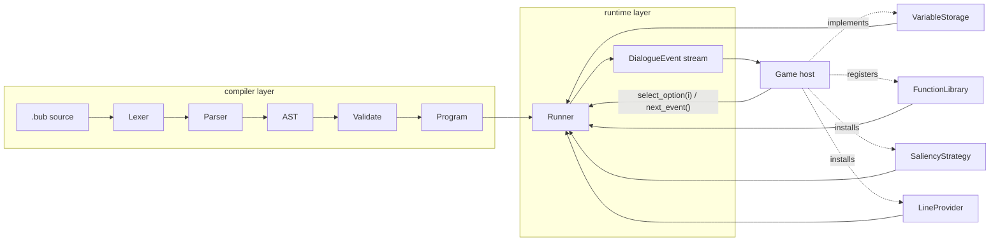

# bubbles — minimal Rust dialogue engine

## 1. Scope — what we keep, what we drop

### Kept — core dialogue (the 20% that gives 80% of the value)
1. **Nodes** — `title:` header + `---` body + `===` terminator. Optional `tags:` passthrough and arbitrary `key: value` headers preserved as metadata.
2. **Lines** with optional `Speaker:` attribution and trailing `#hashtag` metadata.
3. **Shortcut options** (`->`) with optional `<<if cond>>` guard and indented block bodies.
4. **Jumps** — `<<jump NodeName>>`.
5. **Conditionals** — `<<if>>` / `<<elseif>>` / `<<else>>` / `<<endif>>`.
6. **Typed variables** — `Number(f64)`, `Text(String)`, `Bool(bool)`; `<<set $x = expr>>` (and `to` alias).
7. **Host commands** — any other `<<verb arg1 arg2>>` is surfaced to the host as an event.
8. **Full expressions** — arithmetic, comparison, boolean, unary, parens, proper precedence.
9. **Inline substitution** — `{expr}` anywhere in line / option / command text.
10. **Function library** — built-ins (`random`, `visited`, `visited_count`, `dice`) + host-registered pure functions callable inside any expression.
11. **Pluggable variable storage** via trait (in-memory default; enables save/load from the host side).

### Kept — modern narrative-engine features
12. **`<<once>>` / `<<once if>>` / `<<endonce>>`** with optional `<<else>>` — "run this exactly once" blocks, plus option-level once variants. Extremely common real-world pattern.
13. **`<<detour NodeName>>` + `<<return>>`** — subroutine-style call/return on a dedicated stack inside the Runner. Makes shared scenes (barks, cutscenes, dialog fragments) reusable.
14. **Smart variables** — `<<declare $x = expr>>` registers a read-only computed variable; reads re-evaluate. Trivially small addition that massively cleans up scripting.
15. **Line groups** (`=>` prefix) — a set of alternatives, one selected by the active saliency strategy. Powers NPC "barks" and variation dialogue.
16. **Node groups** — multiple nodes sharing a title, filtered by `when: <condition>` headers, selected by saliency. This is the storylet pattern used by Dredge, Lil Guardsman, etc.
17. **Saliency strategy** trait with built-in `First`, `Random`, and `BestLeastRecentlyViewed` implementations. Hosts can register custom strategies.

### Kept — cheap gap-closers (~195 LOC total across items 18-23)
18. **Metadata on options and commands** — not just lines. Hashtags parsed into `DialogueOption.metadata` and `DialogueEvent::Command { metadata }` identically to lines.
19. **`LineProvider` trait** — single-method pluggable seam (`fn lookup(&self, line_id: &str, default: &str) -> Cow<str>`) consulted by the Runner before emitting any `#line:id`-tagged line. Default identity impl. Hosts wire their own string-table / localisation here; we stay out of CSV/CLDR.
20. **Expanded built-in function stdlib** — `visited`, `visited_count`, `random`, `random_range`, `dice`, `round`, `floor`, `ceil`, `min`, `max`.
21. **Multi-file compile** — `compile_many(&[(name, source)]) -> Result<Program>` merges sources, errors on duplicate node titles. Narrative projects always span files.
22. **Compile-time reference validation** — every `<<jump>>`, `<<detour>>`, line-group ref, and node-group ref is verified to resolve during `compile()`. Catches the #1 real-world bug (typo'd node name) at load time instead of at runtime. Best single ROI item in the plan.
23. **Program introspection API** — `program.node_titles()`, `program.node_tags(name)`, `program.variable_declarations()`, `program.node_exists(name)`. Enables save systems, debuggers, and future editor tooling at near-zero cost.

### Deliberately dropped from v1 (rationale included in crate docs)
- **Bytecode / serialized programs** — a tree-walking interpreter is simpler, plenty fast for dialogue, and we keep a `Backend` seam so a bytecode compiler can be added later without breaking the public API.
- **Markup parser** (`[b]text[/b]`, `[color=red]…[/color]`, self-closing, `[nomarkup]`) — every host will want slightly different markup semantics; shipping a generic one creates more friction than value. Line text is emitted raw; hosts parse. Revisit in v0.2 once real-world usage clarifies which markup surface is worth standardising.
- **Format functions** (`[select][plural][ordinal]`) — localisation polish. `select`-style behavior is achievable via a registered function call in `{…}` interpolation. Revisit in v0.2 once a CLDR dep is justified.
- **Enums** (`<<enum>>...<<endenum>>`) — without a type checker to back them, they add surface area with no real ergonomic win over `<<set $suit = "Hearts">>`. Deferred to v0.2 alongside a full static analysis pass.
- **Shadow lines** (`#shadow:id`) — captured for free via the hashtag metadata passthrough; the substitution semantics belong to a future `LineProvider` impl, not the runtime.
- **Full localisation pipeline** (CSV import/export, voice-over timing) — belongs in tooling / host-side crates. The `LineProvider` trait is our single minimal seam.
- **Async function primitives** — the pull-based API handles long-running commands naturally (host simply delays `next_event()`). Documented pattern, no runtime machinery.
- **Writer tooling** (VSCode extension, try.bubbles.dev, graph visualiser) — out of scope for this crate entirely; the introspection API lays groundwork for a future tooling project.

## 2. Architecture



Key seam: `Runner` depends only on the four extension traits above, never on concrete types — SOLID DIP from the start, and it's what makes the crate engine-agnostic. The layers map 1-to-1 onto the folder layout in section 3.

## 3. Crate layout

### 3.1 Organisation strategy

**Single crate, module folders under `src/`** — not a multi-crate workspace. At ~3-4k LOC total we don't have enough surface area to justify independent Cargo.toml / semver / publishing for multiple crates, and the umbrella-crate pattern would add ceremony without proportional benefit. Module folders give us the same separation of concerns with zero overhead.

If a future need emerges (e.g. `bubbles-compiler` reused by an editor tool), the module boundaries below are designed so promotion to a workspace is a mechanical move with no public API churn — users keep importing from `bubbles::…`.

### 3.2 File-size discipline

- Hard cap of **~250 LOC per file** (tests excluded). Anything exceeding ~300 LOC is a refactor trigger, not something we merge.
- One concept per file. No file named `utils.rs` / `common.rs` / `helpers.rs` — each piece of functionality has a dedicated, self-describing name.
- `mod.rs` files are thin: they only declare submodules and re-export the module's public surface. No logic lives in a `mod.rs`.
- Every file begins with a module-level doc comment stating its single responsibility in one sentence. Code reviewers use it as the SRP check.

### 3.3 Folder layout

```
bubbles/
├── Cargo.toml
├── README.md
├── CHANGELOG.md
├── LICENSE-MIT
├── LICENSE-APACHE
├── deny.toml
├── rust-toolchain.toml
├── .github/workflows/ci.yml
├── scripts/
│   ├── install-hooks.sh        # installs pre-commit hook
│   └── check-naming.sh         # CI grep check for forbidden references
├── src/
│   ├── lib.rs                  # crate docs, lint gates, flat public re-exports
│   ├── error.rs                # DialogueError + Span + Result alias (thiserror)
│   │
│   ├── value/
│   │   ├── mod.rs              # re-exports
│   │   ├── value.rs            # Value enum + From/TryFrom impls
│   │   └── storage.rs          # VariableStorage trait + HashMapStorage
│   │
│   ├── compiler/
│   │   ├── mod.rs              # pub fn compile / compile_many
│   │   ├── lexer.rs            # logos tokens (spanned)
│   │   ├── ast.rs              # AST node types only (no logic)
│   │   ├── parser/
│   │   │   ├── mod.rs          # Parser struct + entry points
│   │   │   ├── node.rs         # node header + body
│   │   │   ├── statement.rs    # <<set>>, <<if>>, <<jump>>, commands
│   │   │   ├── expression.rs   # precedence-climbing expression parser
│   │   │   ├── options.rs      # shortcut options, guards, indented bodies
│   │   │   └── groups.rs       # line groups (=>) and node-group `when:` headers
│   │   ├── validate.rs         # reference validation pass (jumps/detours/groups)
│   │   └── program.rs          # Program type + introspection accessors
│   │
│   ├── runtime/
│   │   ├── mod.rs              # re-exports Runner, DialogueEvent, DialogueOption
│   │   ├── event.rs            # DialogueEvent + DialogueOption types
│   │   ├── runner.rs           # Runner public API (start, next_event, select_option)
│   │   ├── interpreter.rs      # expression eval + statement stepper
│   │   ├── frame.rs            # per-node frame: cursor, once counters, locals
│   │   ├── call_stack.rs       # detour/return address stack
│   │   ├── interpolation.rs    # {expr} substitution in line/option/command text
│   │   └── line_provider.rs    # LineProvider trait + IdentityLineProvider
│   │
│   ├── saliency/
│   │   ├── mod.rs              # SaliencyStrategy trait + ContentView
│   │   ├── first.rs            # First strategy
│   │   ├── random.rs           # Random strategy
│   │   └── best_lru.rs         # BestLeastRecentlyViewed strategy
│   │
│   └── library/
│       ├── mod.rs              # FunctionLibrary + registration API
│       └── builtins.rs         # visited / visited_count / random / random_range /
│                               # dice / round / floor / ceil / min / max
├── tests/
│   ├── common/
│   │   ├── mod.rs              # play(), play_fixture(), macro re-exports
│   │   ├── harness.rs          # Runner driving helpers
│   │   └── assertions.rs       # assert_events! / choose! macros
│   ├── fixtures/               # *.bub scripts used by integration tests
│   ├── lines.rs
│   ├── expressions.rs
│   ├── variables.rs
│   ├── flow.rs
│   ├── options.rs
│   ├── commands.rs
│   ├── functions.rs
│   ├── once.rs
│   ├── groups.rs
│   ├── compile.rs
│   ├── localization.rs
│   └── save_load.rs
└── examples/
    └── cli_runner.rs           # terminal play-through driver
```

Every folder under `src/` corresponds to one layer of the architecture diagram: `value` (data model), `compiler` (source → Program), `runtime` (Program → DialogueEvents), `saliency` (pluggable selection policy), `library` (pluggable function registry). No cross-layer back-references — the dependency graph flows strictly `runtime → compiler → value`, which means `compiler` never needs to know about `runtime` types and is independently testable / reusable.

## 4. Dependencies (kept tiny on purpose)

- `thiserror` — idiomatic error enum
- `logos` — derive-based, zero-runtime-cost lexer (smallest real option)
- `indexmap` — preserve node/option insertion order
- `rand` (optional, feature `rand`) — for `random()` builtin
- `serde` (optional, feature `serde`) — derive `Serialize`/`Deserialize` on `Value`, `Program`, and `HashMapStorage` for save/load
- No parser generator (hand-written recursive descent — smaller and gives us full control over error spans)

## 5. Public API

### 5.1 Design principles

- **Flat root namespace** — everything a normal host needs is re-exported directly under `bubbles::…`. No one should have to write `bubbles::runtime::runner::Runner` to use the crate. Deep paths exist only for advanced users who want specific sub-pieces.
- **Pull, sync, zero-async** — `runner.next_event()` returns `Result<Option<DialogueEvent>>`, `None` meaning "dialogue ended". The host drives the clock. Fits Bevy systems, Godot `_process`, plain game loops, and tests identically.
- **Fail-fast errors at compile, graceful errors at runtime** — every structural problem (typo'd jump, duplicate node title, unresolved reference) is a `DialogueError` returned from `compile` / `compile_many` with a source span. Runtime errors are also `DialogueError` but rare by design.
- **Four extension traits, each single-method where possible** — `VariableStorage`, `FunctionLibrary` (registration API), `SaliencyStrategy`, `LineProvider`. Hosts implement what they need, default impls cover the rest.
- **`#[non_exhaustive]` on every public enum that may grow** — `DialogueEvent`, `DialogueError`, future content kinds. Adding a variant is never a breaking change.

### 5.2 "Hello world" a user writes

```rust
use bubbles::{compile, DialogueEvent, HashMapStorage, Runner};

fn main() -> Result<(), bubbles::DialogueError> {
    let program = compile(r#"
        title: Start
        ---
        Alice: Welcome to the jam.
        -> Ready
            Alice: Here we go.
        -> Not yet
            Alice: Take your time.
        ===
    "#)?;

    let mut runner = Runner::new(program, HashMapStorage::new());
    runner.start("Start")?;

    while let Some(event) = runner.next_event()? {
        match event {
            DialogueEvent::Line { speaker, text, .. } => {
                println!("{}: {text}", speaker.as_deref().unwrap_or("?"));
            }
            DialogueEvent::Options(opts) => {
                for (i, o) in opts.iter().enumerate() {
                    println!("  {i}) {}", o.text);
                }
                runner.select_option(0)?;
            }
            _ => {}
        }
    }
    Ok(())
}
```

### 5.3 Root-level public surface (`bubbles::*`)

```rust
// --- data model ---
pub enum Value { Number(f64), Text(String), Bool(bool) }
pub trait VariableStorage { fn get(&self, name: &str) -> Option<Value>; fn set(&mut self, name: &str, value: Value); }
pub struct HashMapStorage;

// --- compilation ---
pub fn compile(source: &str) -> Result<Program, DialogueError>;
pub fn compile_many(sources: &[(&str, &str)]) -> Result<Program, DialogueError>;
pub struct Program { /* opaque */ }
impl Program {
    pub fn node_titles(&self) -> impl Iterator<Item = &str>;
    pub fn node_tags(&self, title: &str) -> Option<&[String]>;
    pub fn variable_declarations(&self) -> &[VariableDecl];
    pub fn node_exists(&self, title: &str) -> bool;
}

// --- runtime ---
pub struct Runner<S: VariableStorage> { /* opaque */ }
impl<S: VariableStorage> Runner<S> {
    pub fn new(program: Program, storage: S) -> Self;
    pub fn start(&mut self, node: &str) -> Result<(), DialogueError>;
    pub fn next_event(&mut self) -> Result<Option<DialogueEvent>, DialogueError>;
    pub fn select_option(&mut self, index: usize) -> Result<(), DialogueError>;
    pub fn library_mut(&mut self) -> &mut FunctionLibrary;
    pub fn set_saliency(&mut self, strategy: Box<dyn SaliencyStrategy>);
    pub fn set_line_provider(&mut self, provider: Box<dyn LineProvider>);
    pub fn storage(&self) -> &S;
    pub fn storage_mut(&mut self) -> &mut S;
}

#[non_exhaustive]
pub enum DialogueEvent {
    NodeStarted(String),
    Line { speaker: Option<String>, text: String, metadata: Vec<String> },
    Options(Vec<DialogueOption>),
    Command { name: String, args: Vec<String>, metadata: Vec<String> },
    NodeComplete(String),
    DialogueComplete,
}

pub struct DialogueOption { pub text: String, pub metadata: Vec<String>, pub available: bool }

// --- extension traits ---
pub struct FunctionLibrary;
impl FunctionLibrary {
    pub fn register<F>(&mut self, name: &str, f: F) where F: Fn(&[Value]) -> Result<Value, DialogueError> + Send + Sync + 'static;
}
pub trait SaliencyStrategy { fn choose(&mut self, candidates: &[ContentView<'_>]) -> Option<usize>; }
pub trait LineProvider { fn lookup<'a>(&'a self, line_id: &str, default: &'a str) -> Cow<'a, str>; }

// --- error ---
#[non_exhaustive]
pub enum DialogueError { /* thiserror variants with Span */ }
```

### 5.4 Advanced sub-namespaces

Kept out of the root to keep the elevator view small. Reachable via fully-qualified paths for hosts that need them:

- `bubbles::saliency::{First, Random, BestLeastRecentlyViewed}` — built-in strategy impls
- `bubbles::compiler::ast` (`#[doc(hidden)]` unless feature `compiler-internals`) — AST types for tooling
- `bubbles::runtime::frame` (`#[doc(hidden)]`) — debugger / replay tooling hook points

The root re-exports are the *product*; the inner modules are *implementation detail* users can opt into.

## 6. TDD execution plan

### 6.1 Two-layer test pattern (enforced from commit 01)

- **Unit tests** — `#[cfg(test)] mod tests` at the bottom of every source file. Exercise a single function / method in isolation. Fast, cheap, many.
- **Integration tests** — `tests/*.rs`. Drive the full `compile → Runner → event-stream` path. Each feature ships with at least one integration test; **existing integration tests are never deleted**, only extended — this is how we guarantee features "stay working" as the engine grows.

### 6.2 Fixture-driven integration harness (introduced at step 06)

`tests/common/mod.rs` provides a tiny DSL used by every integration test:

```rust
fn play(source: &str, start_node: &str) -> Result<Vec<DialogueEvent>, DialogueError>;
fn play_with<F: FnOnce(&mut Runner<HashMapStorage>)>(source: &str, start: &str, setup: F) -> ...;

// Human-readable expectations for tables of events.
assert_events!(actual, [
    NodeStarted("Greet"),
    Line { speaker: Some("Alice"), text: "Hi.", .. },
    NodeComplete("Greet"),
    DialogueComplete,
]);
```

Larger scripts live in `tests/fixtures/*.bub` and load by name via `play_fixture("storylets")`. Reading a fixture file + its matching integration test should be enough for any contributor to understand what a feature does — tests act as the living specification.

### 6.3 Commit cadence

One conventional-commit per step. Each step: write the failing test (red), minimal code to make it pass (green), refactor for clarity. A pre-commit hook runs `cargo fmt`, `cargo clippy --all-features -D warnings`, and `cargo test --all-features` locally before any commit is accepted — exactly the gates CI enforces. Steps 01–05 form a walking skeleton: the crate compiles, runs an empty node end-to-end, and ships green CI before any real feature work begins.

### 6.4 Step sequence

| # | Conventional commit subject | Integration test | Red → Green → Refactor |
|---|---|---|---|
| 01 | `chore: scaffold workspace, CI, lints, licenses, deny.toml` | — | baseline green |
| 02 | `feat(value): Value enum and VariableStorage trait with HashMapStorage` | — (unit only) | get/set + From/TryFrom |
| 03 | `feat(lexer): logos-based tokens with spans` | — (unit + proptest) | round-trip over token categories |
| 04 | `feat(parser): empty node with title header` | `tests/compile.rs::empty_node` | parse `title:` + `---`/`===` delimiters |
| 05 | `feat(runner): emits NodeStarted and DialogueComplete` | `tests/flow.rs::empty_node_end_to_end` | walking skeleton complete |
| 06 | `feat(runner): Line events with optional speaker` | `tests/lines.rs` + fixture `lines_basic.bub` | introduce `assert_events!` DSL |
| 07 | `feat(parser): multi-line bodies and character attribution` | `tests/lines.rs` extension | extend fixture with `Alice:` prefixed lines |
| 08 | `feat(expr): arithmetic evaluator with precedence` | `tests/expressions.rs` + proptest | evaluator unit tests, Pratt or precedence-climbing |
| 09 | `feat(expr): comparison, boolean, unary operators` | `tests/expressions.rs` extension | property tests for commutativity/associativity |
| 10 | `feat(stmt): set statement reads and writes variables` | `tests/variables.rs` | `<<set $x = expr>>` + variable reads |
| 11 | `feat(flow): if/elseif/else/endif blocks` | `tests/flow.rs` extension | nested conditionals fixture |
| 12 | `feat(text): inline {expr} substitution` | `tests/lines.rs` extension | same evaluator, reused — DRY locks in |
| 13 | `feat(options): shortcut options and select_option round-trip` | `tests/options.rs` + fixture `branch.bub` | assertion DSL gains `choose!(index)` helper |
| 14 | `feat(options): <<if>> guards on options` | `tests/options.rs` extension | guarded-option fixture |
| 15 | `feat(options): indented block bodies under options` | `tests/options.rs` extension | scope handling verified |
| 16 | `feat(flow): <<jump NodeName>> transitions` | `tests/flow.rs` extension | asserts NodeComplete/NodeStarted ordering |
| 17 | `feat(commands): generic <<verb args>> emits Command event` | `tests/commands.rs` | args + interpolation reuse |
| 18 | `feat(library): FunctionLibrary with random and dice built-ins` | `tests/functions.rs` | seeded-rng test for determinism |
| 19 | `feat(runner): visited-node tracking + visited()/visited_count()` | `tests/functions.rs` extension | replay fixture verifies counters |
| 20 | `feat(library): host-registered custom functions` | `tests/functions.rs` extension | closure-registered `double($n)` |
| 21 | `feat(flow): <<once>>/<<once if>>/<<endonce>> with <<else>>` | `tests/once.rs` + fixture | re-enter node, asserts variant |
| 22 | `feat(flow): <<detour>> and <<return>> with call stack` | `tests/flow.rs` extension | nested detour fixture |
| 23 | `feat(vars): smart variables via <<declare $x = expr>>` | `tests/variables.rs` extension | read-only enforcement test |
| 24 | `feat(saliency): SaliencyStrategy trait + First/Random/BLRV` | `tests/groups.rs` | strategy swap asserts deterministic choices |
| 25 | `feat(groups): line groups (=>) selected by saliency` | `tests/groups.rs` extension | bark-style fixture |
| 26 | `feat(groups): node groups with when: headers` | `tests/groups.rs` extension | storylet fixture |
| 27 | `feat(meta): hashtag metadata on options and commands` | `tests/options.rs` + `tests/commands.rs` extensions | |
| 28 | `feat(i18n): LineProvider trait consulted for #line:id` | `tests/localization.rs` | mock provider returns translated text |
| 29 | `feat(library): expanded stdlib (random_range/round/floor/ceil/min/max)` | `tests/functions.rs` extension | |
| 30 | `feat(compile): compile_many merges multiple sources` | `tests/compile.rs` extension | duplicate-title error test |
| 31 | `feat(compile): reference validation for jumps/detours/groups` | `tests/compile.rs` extension | typo'd jump yields structured error |
| 32 | `feat(program): introspection accessors` | `tests/compile.rs` extension | |
| 33 | `feat(serde): snapshot and restore Runner mid-dialogue` | `tests/save_load.rs` | covers detour stack + once counters + saliency state + storage |
| 34 | `docs: crate-level rustdoc, doc tests, README quick-start` | doc tests auto-run in CI | |
| 35 | `feat(example): cli_runner terminal driver` | manual smoke | |
| 36 | `chore: CHANGELOG 0.1.0, semver gate, release checklist` | — | tag `v0.1.0` |

Each step leaves CI green. If a step starts to bloat, it is split into `feat:` + `refactor:` commits rather than merged into one big change.

## 7. Quality gates wired up on day one

- **Lints**: `#![deny(missing_docs, unsafe_code, rust_2024_idioms)]`, `#![warn(clippy::pedantic, clippy::nursery, clippy::cargo)]`
- **Edition 2024**, MSRV pinned and enforced in CI
- **Pre-commit hook** (`.git/hooks/pre-commit` installed by a `scripts/install-hooks.sh`): `cargo fmt --check`, `cargo clippy --all-features -- -D warnings`, `cargo test --all-features`, `scripts/check-naming.sh`. Same gates as CI — no broken commit ever lands locally.
- **CI** (GitHub Actions): `fmt --check`, `clippy -D warnings`, `test --all-features`, `test --no-default-features`, `doc --no-deps -D warnings`, `cargo-deny`, `scripts/check-naming.sh`
- **File-size guard**: `scripts/check-file-sizes.sh` flags any `src/**/*.rs` over 300 LOC so overgrown files get refactored instead of accreting.
- **Property tests** (`proptest`) for the expression evaluator
- **Doc tests** for every public item
- **Dual license** Apache-2.0 OR MIT, `CODE_OF_CONDUCT.md`, `CONTRIBUTING.md`, Conventional Commits, keep-a-changelog `CHANGELOG.md`, semver discipline, `#[non_exhaustive]` on public enums that may grow.

## 8. SOLID / DRY checklist (how the design earns it)

- **SRP** — every *file* has one responsibility, stated in its module doc-comment; every *folder* represents one architectural layer (`value` / `compiler` / `runtime` / `saliency` / `library`). File-size cap of ~250 LOC enforces this at the mechanical level.
- **OCP** — `VariableStorage`, `FunctionLibrary`, `SaliencyStrategy`, and `LineProvider` are four distinct extension points; a future `Backend` trait lets a bytecode VM be swapped in without breaking callers.
- **LSP** — trait contracts documented; any impl (hashmap / serde-backed / ECS-backed storage; First / Random / custom saliency; identity / CSV-backed / DB-backed line provider) is substitutable.
- **ISP** — each trait has only the methods its collaborator actually needs: `VariableStorage` has two, `SaliencyStrategy` has one, `LineProvider` has one.
- **DIP** — `Runner` takes a generic `S: VariableStorage` and owns boxed `dyn SaliencyStrategy` / `dyn LineProvider`; no concrete coupling. Dependency graph flows strictly `runtime → compiler → value`; never the other way.
- **DRY** — one expression evaluator used by `<<if>>`, `<<set>>`, `<<declare>>`, `<<once if>>`, `{expr}` substitution, option guards, line-group guards, and node-group `when:` clauses. One token stream used by all parser entry points. One hashtag-metadata parser used for lines / options / commands. One fixture-runner harness used by every integration test.

## 9. Open decision I'm defaulting

- **Crate name**: `bubbles` (matches the workspace). File extension for scripts: `.bub` — short, unambiguous, won't collide with any game-engine asset convention. Happy to change either.
- **Naming discipline**: no prior-art engine is referenced anywhere in the codebase, docs, comments, tests, fixtures, CHANGELOG, or README. The crate stands on its own identity. Enforced by a `scripts/check-naming.sh` grep check wired into CI.

If you want to adjust scope (e.g. pull markup back in as an optional feature, or push bytecode into v1) say the word before I start executing; otherwise I'll switch to agent mode and begin with step 01 (scaffold) of the commit sequence.